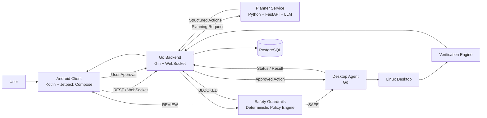

## `architecture.md`

```text
# Safety Guardrails - System Architecture Diagram

## Purpose

This document describes the complete high-level architecture of the Safety Guardrails system.

The system consists of:

- Android Client
- Go Backend
- Planner Service
- Safety Guardrails
- PostgreSQL
- Go Desktop Agent
- Linux Desktop
- Verification Engine

Core principle:

AI plans.
Policy decides.
Agent executes.
Verifier confirms.

## High-Level Architecture



## Component Responsibilities

### Android Client

Technology:

- Kotlin
- Jetpack Compose

Responsibilities:

- Receive user instructions.
- Display task status.
- Display planned actions.
- Display safety decisions.
- Request user approval.
- Display execution progress.
- Display verification result.
- Display task history.

Android must never execute desktop commands directly.

### Go Backend

Technology:

- Go
- Gin
- WebSocket

Responsibilities:

- REST API.
- WebSocket communication.
- Task coordination.
- Device management.
- Planner communication.
- Guardrail coordination.
- Desktop agent communication.
- Database persistence.
- Audit logging.

The backend is the central coordinator.

### Planner Service

Technology:

- Python
- FastAPI
- Pydantic
- LLM API

Responsibilities:

- Interpret natural language.
- Convert instructions into structured actions.
- Validate structured output format.

The planner only proposes actions.

The planner does not make the final safety decision.

### Safety Guardrails

Responsibilities:

- Validate action type.
- Validate parameters.
- Validate target.
- Check protected resources.
- Check allowed scope.
- Determine risk level.
- Allow SAFE actions.
- Request approval for REVIEW actions.
- Block BLOCKED actions.

The guardrail layer is authoritative over planner output.

### Desktop Agent

Technology:

- Go

Target platform:

- Linux

Responsibilities:

- Maintain connection with backend.
- Receive approved actions.
- Perform local validation.
- Execute supported actions.
- Return execution results.
- Trigger verification.

The desktop agent must never execute arbitrary shell commands by default.

### Verification Engine

Responsibilities:

- Check resulting system state.
- Determine whether execution actually succeeded.
- Return VERIFIED, FAILED, or UNCERTAIN.

### PostgreSQL

Stores:

- Users.
- Devices.
- Tasks.
- Actions.
- Executions.
- Verifications.
- Audit logs.

## Security Boundary

The critical security boundary is:

Planner -> Safety Guardrails -> Desktop Agent

The planner must never directly control the desktop.

Every action must pass deterministic safety validation before execution.

The desktop agent must validate the received action again before executing it.

## Design Principle

The system must maintain separation of responsibility:

Planner:
"What should be done?"

Guardrail:
"Is this allowed?"

User:
"Do I approve this risky action?"

Agent:
"Execute the approved action."

Verifier:
"Did it actually happen?"

Backend:
"Coordinate and record everything."
```
