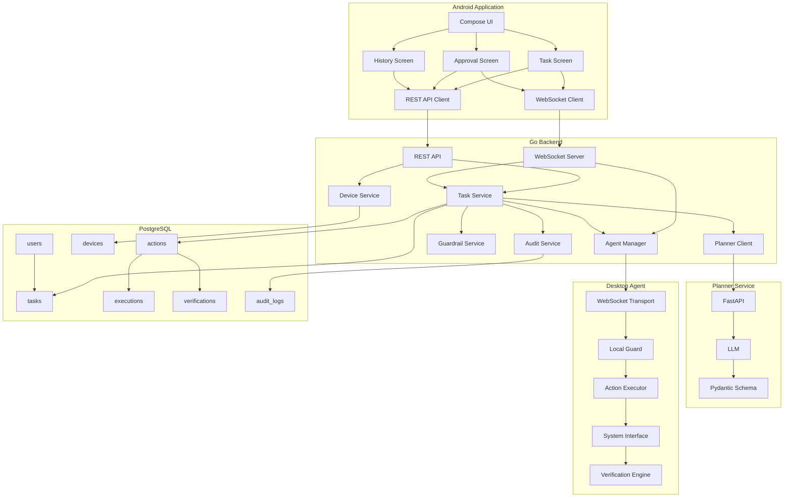

## `component.md`

```text
# Safety Guardrails - Component Diagram

## Purpose

This document describes the internal components of the Safety Guardrails system.

## Component Architecture



## Component Responsibilities

### Android UI

Responsible for user interaction.

Main screens:

- Task screen.
- Approval screen.
- History screen.
- Device screen.

### REST API

Responsible for standard HTTP requests.

Examples:

- Create task.
- Get task.
- Get devices.
- Approve task.
- Cancel task.
- Get task history.

### WebSocket Server

Responsible for real-time communication.

Used for:

- task progress
- execution updates
- verification updates
- desktop agent connection
- desktop agent results

### Task Service

Responsible for task lifecycle.

Responsibilities:

- create task
- update task
- call planner
- trigger guardrail
- coordinate execution
- update task state
- trigger verification

### Device Service

Responsible for desktop device management.

Responsibilities:

- register device
- pair device
- track online/offline status
- track last seen time

### Planner Client

Responsible for communicating with the Python planner.

The planner client must validate the returned structured data before passing it to the next stage.

### Guardrail Service

Responsible for deterministic safety decisions.

It must not depend on an LLM for final authorization.

### Agent Manager

Responsible for connected desktop agents.

Responsibilities:

- track connections
- identify target device
- send approved actions
- receive execution results

### Audit Service

Responsible for security and lifecycle logging.

### Planner Service

Responsible for converting natural language into structured actions.

It proposes actions but does not authorize them.

### Desktop Agent

Responsible for actual desktop execution.

### Local Guard

Performs another safety validation immediately before execution.

### Action Executor

Maps supported action types to controlled implementations.

Example:

create_directory
open_application
get_system_info
move_file

### System Interface

Provides controlled access to Linux system functionality.

It should avoid unrestricted shell execution.

### Verification Engine

Checks the resulting desktop state.

Examples:

- process exists
- file exists
- file metadata matches
- expected exit code
- expected output
- system state changed as expected

### PostgreSQL

Stores persistent system data and audit information.

## Architecture Principle

Components must have clear responsibilities.

No component should bypass the safety layer.

The expected execution chain is:

User
-> Android
-> Backend
-> Planner
-> Guardrail
-> Approval if required
-> Desktop Agent
-> Executor
-> Verification
-> Backend
-> Android
```
