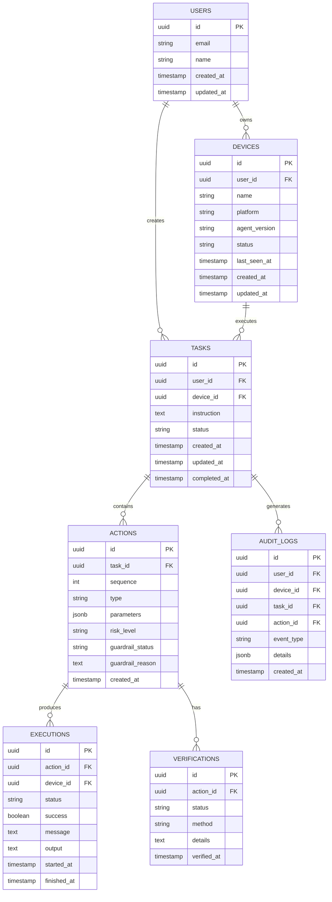
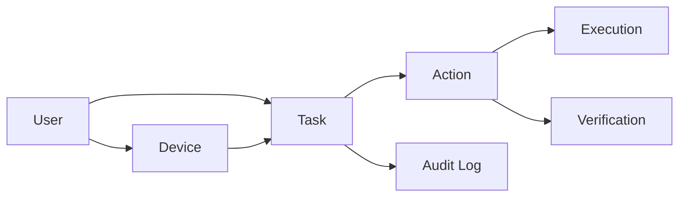

## `database-erd.md`

```text
# Safety Guardrails - Database ERD

## Purpose

This document describes the PostgreSQL database structure and relationships.

## Entity Relationship Diagram



## Entity Responsibilities

### USERS

Represents users of the system.

A user can own multiple devices and create multiple tasks.

### DEVICES

Represents desktop agents connected to the system.

A device belongs to a user.

A device can execute multiple tasks.

### TASKS

Represents a complete user request.

A task contains the original natural language instruction and its current lifecycle state.

### ACTIONS

Represents structured actions generated by the planner.

One task can contain multiple actions.

The sequence field determines execution order.

### EXECUTIONS

Represents actual execution attempts.

It records whether the desktop agent successfully executed an action.

### VERIFICATIONS

Represents verification of the resulting system state.

Verification determines whether the action actually achieved the expected result.

### AUDIT_LOGS

Stores important security and lifecycle events.

Audit logs are used to reconstruct what happened during task execution.

## Database Relationship Flow



## Data Lifecycle

The database should preserve:

1. Original user instruction.
2. Planner output.
3. Guardrail decision.
4. Risk classification.
5. Approval decision.
6. Execution result.
7. Verification result.
8. Final task status.
9. Important audit events.

## Database Principle

The database is the persistent source of truth for task history.

The system must not depend only on in-memory state for important task information.
```
