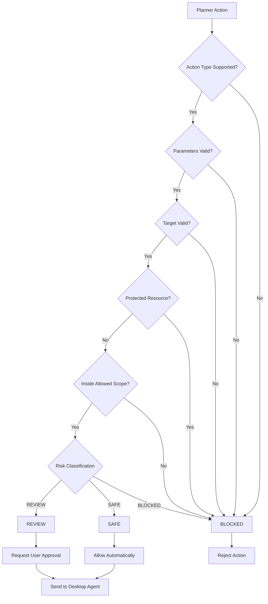
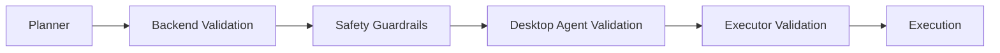

## `guardrail-flow.md`

```text
# Safety Guardrails - Guardrail Decision Diagram

## Purpose

This document describes how the system determines whether an AI-generated action can be executed.

The guardrail is deterministic.

The LLM must not make the final safety decision.

## Guardrail Decision Flow



## Risk Levels

### SAFE

SAFE means the action is considered low risk and can execute automatically.

Examples:

- Get system information.
- Get process information.
- Read file metadata.
- Create temporary directory inside allowed workspace.
- Create temporary file inside allowed workspace.

SAFE actions do not require user approval.

### REVIEW

REVIEW means the action may be legitimate but has meaningful side effects.

Examples:

- Shutdown.
- Sleep.
- Lock desktop.
- Close application.
- Move file.
- Run predefined project command.
- Modify files inside allowed workspace.

REVIEW actions require explicit user approval.

### BLOCKED

BLOCKED means the action is prohibited.

Examples:

- Delete operating system files.
- Access protected credentials.
- Execute unrestricted shell commands.
- Disable safety mechanisms.
- Access paths outside the allowed scope.
- Perform destructive recursive deletion.

BLOCKED actions cannot be executed through the normal approval flow.

## Validation Layers

Every action must pass:

1. Action type validation.
2. Parameter validation.
3. Target validation.
4. Protected resource validation.
5. Allowed scope validation.
6. Risk classification.
7. Policy decision.
8. Approval requirement if necessary.
9. Final execution authorization.

## Defense in Depth



## Fail-Closed Rule

If validation fails because of:

- Unknown action.
- Invalid parameters.
- Invalid path.
- Protected resource.
- Missing policy.
- Invalid configuration.
- Internal safety error.
- Missing safety information.

The action must NOT execute.

Default behavior:

DENY EXECUTION.

## Shell Execution Policy

Arbitrary shell execution is not allowed in the MVP.

The system must not provide a general-purpose action such as:

run_shell(command)

Instead, use explicit predefined actions.

Example:

run_project_tests

is an allowed controlled action if implemented.

Example:

run_command("rm -rf /")

must never be accepted.

## Core Security Principle

The LLM can propose an action.

The deterministic policy engine decides whether that action is allowed.

The desktop agent executes only actions that passed validation.
```
