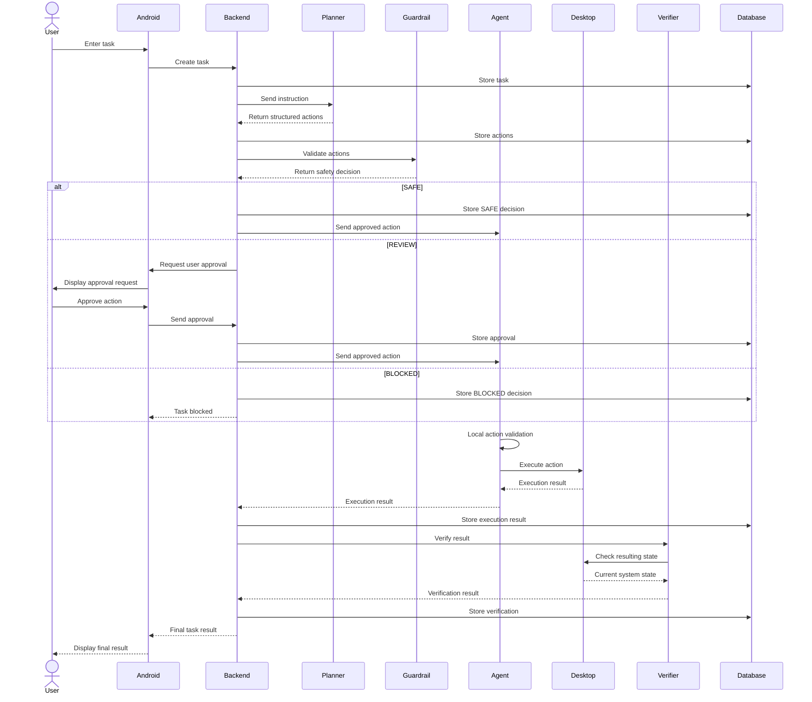
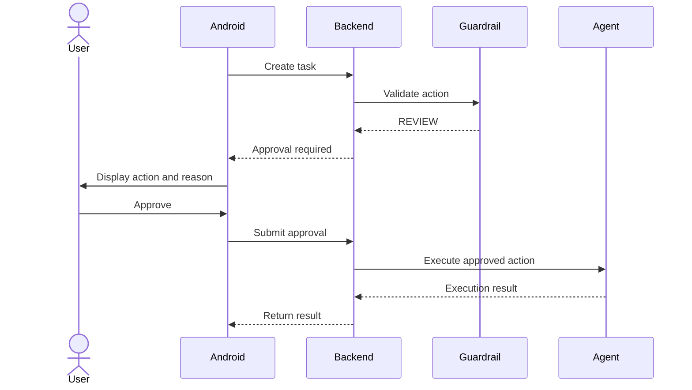
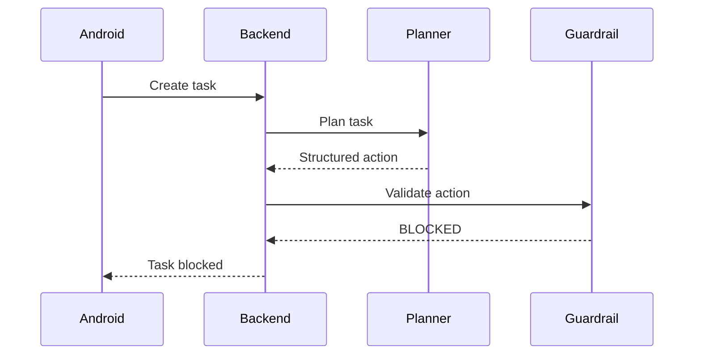

## `sequence.md`

```text
# Safety Guardrails - Sequence Diagram

## Purpose

This document describes communication between the major system components during task execution.

## Normal Task Execution




## REVIEW Flow



## BLOCKED Flow



## Important Communication Rules

1. Planner must never communicate directly with Desktop Agent.
2. Backend coordinates communication between services.
3. Guardrail validation must happen before execution.
4. REVIEW actions require explicit approval.
5. BLOCKED actions must stop before execution.
6. Execution results must be persisted.
7. Verification should happen after execution.
8. Final task status must be based on execution and verification results.
```
