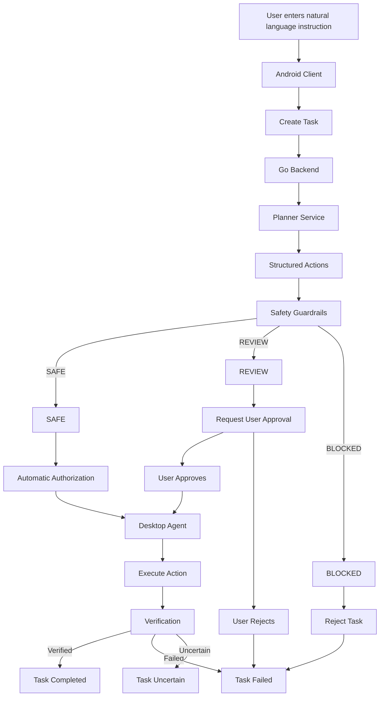
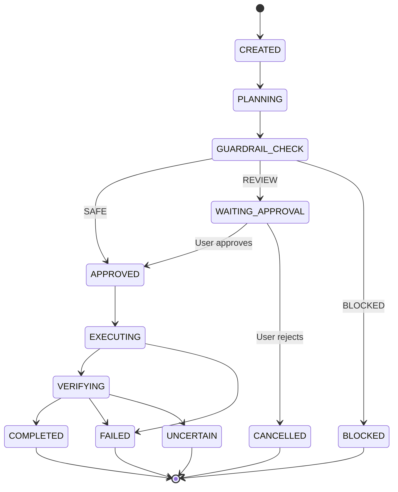

## `task-flow.md`

```text
# Safety Guardrails - Task Flow Diagram

## Purpose

This document describes the lifecycle of a task from the initial user instruction until the final result.

## Main Task Flow



## Task State Machine



## Task States

### CREATED

Task has been created by the user but has not been planned yet.

### PLANNING

Backend sends the user instruction to the planner.

### GUARDRAIL_CHECK

Planner output is being checked by the safety policy engine.

### WAITING_APPROVAL

At least one action requires explicit user approval.

### APPROVED

The action or task has passed safety requirements and is authorized for execution.

### EXECUTING

Desktop agent is executing the approved action.

### VERIFYING

System is checking whether the requested result actually occurred.

### COMPLETED

Execution and verification succeeded.

### FAILED

Execution or verification failed.

### BLOCKED

The safety policy prohibited the action.

### CANCELLED

User rejected or cancelled the task.

### UNCERTAIN

The system cannot confidently determine whether the requested state was achieved.

## Important Rules

1. Every task must be planned before execution.
2. Every action must pass guardrail validation.
3. SAFE actions may execute automatically.
4. REVIEW actions require explicit user approval.
5. BLOCKED actions cannot execute.
6. Execution success does not automatically mean task success.
7. Verification must confirm the resulting state.
8. Verification failure must not be reported as success.
9. Safety validation must fail closed.
```
